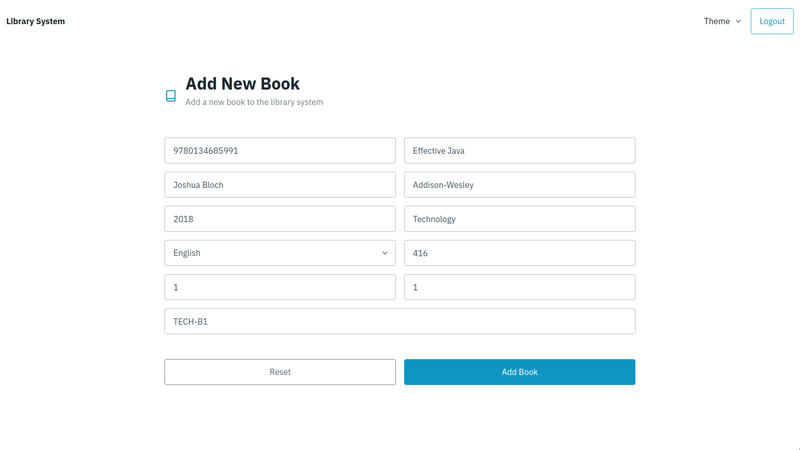
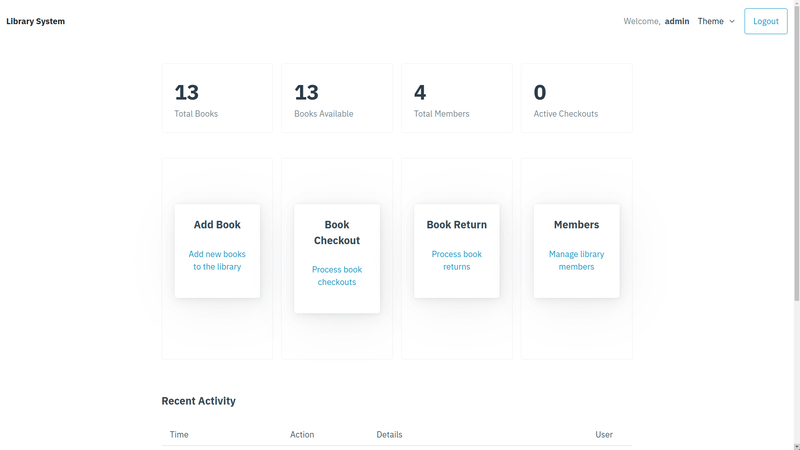
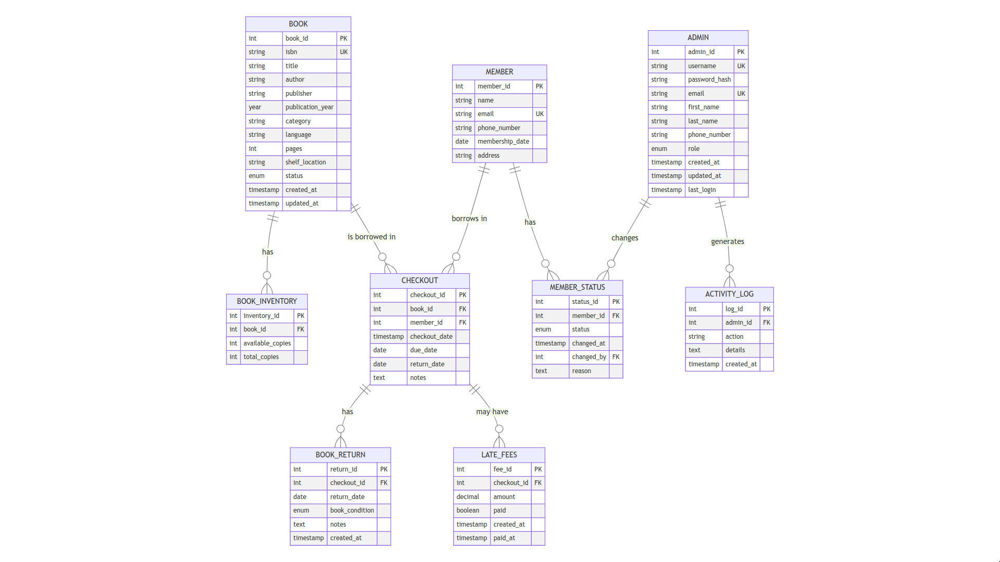

# EGR325-Library-App
EGR325 Database Design Final Project

The is a Full Stack Web Application for managing the various tasks a librarian might face: adding books or users, checking out and returning books, and managing members.
The system is built around a SQL Server, which is interfaced via Go web server with a plain HTML & JS frontend.
I chose to use PicoCSS for the minimal amount of styling I needed and ease of development.

